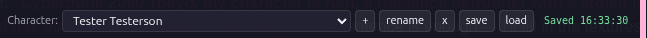

# Marinara RPG Rulesets — Game Mode (v0.4.0)

Custom RPG rulesets for [Marinara Engine](https://github.com/Pasta-Devs/Marinara-Engine)'s Game Mode. Run a D10 dice-pool game (Exalted 3e), a d20 game (D&D 5e), a 4dF narrative game (Fate Core), or **author your own ruleset for any tabletop RPG** — without forking Marinara, without writing TypeScript, without waiting for upstream feature requests.

## Quick start (5 minutes)

The fastest path: grab the self-contained release at [`releases/v0.4.0/`](releases/v0.4.0/) and follow [`releases/v0.4.0/INSTALL-GUIDE.md`](releases/v0.4.0/INSTALL-GUIDE.md). It includes:

- **The framework JS** to paste into Marinara's Extensions panel
- **Two complete reference rulesets** (D&D 5e and Exalted 3e) with bundle + agents pre-built, ready to paste
- **Seven AI-feedable build documents** so you can have ChatGPT, Claude.ai, or any chat AI author a ruleset for any other system (GURPS, Cyberpunk RED, Vampire, Mörk Borg — anything)
- **Step-by-step install + build guides** in plain language for non-technical users

If you just want to play D&D or Exalted, install the extension and import the ruleset bundle and you're on your way. Other systems are being added as requested and you can submit a PR to add one you've created to the repo.

If you want a system the framework doesn't ship, see [`releases/v0.4.0/BUILD-YOUR-OWN-RULESET.md`](releases/v0.4.0/BUILD-YOUR-OWN-RULESET.md) — options for AI-assisted or manual authoring.

## What this is

Marinara Engine ships a Game Mode where an AI Game Master runs the table. By default the engine's GM is biased toward d20 / D&D-style mechanics: six attributes (STR/DEX/CON/INT/WIS/CHA), single-roll resolution, DC ladder. This repo adds a thin overlay that lets you swap the GM's mechanical brain (and the player-facing character sheet) for a different RPG system entirely.

The framework is **system-agnostic by design**. A GM Mode Prompt Injection helps insert ruleset instructions while a rules lore book will provide Marinara with instructions on how to run the selected system. This allows systems to be created based around existing dice mechanics. Build instructions are present to allow an AI Agent, chat or CLI, to create a ruleset featuring a character sheet, GM Agent Prompt, and Lore book with the core mechanics.

## What's new in v0.4.0

- **Typed damage** on health-style tracks: declare `damageTypes` and the renderer color-codes each cell, severity-stacks the worst damage leftmost, and gives the state-mutator per-type field names (`field="bashing" delta="+3"`).
- **Sorcery / multi-turn casting category** in the spellbook. Spells filed under `"sorcery"` get auto-tagged in their lorebook entries, signaling the state-mutator to use multi-turn shape-sorcery flow (declare → accumulate sorcerous motes → unleash with Willpower refund).
- **Agents decoupled from bundle.** New `tools/build-agents.mjs` produces `agents.json` separately from the bundle. Users import via Marinara's Import Agents dialog (delete-then-replace, no duplicate accumulation). Prompt updates ship without forcing users to reinstall the entire ruleset.
- **CSP-safe formula evaluator.** The `{StatName}*N+M` parser uses recursive descent instead of `new Function`. Marinara pages with strict CSP that blocks `'unsafe-eval'` now compute bar maxes correctly.
- **State-mutator field-name normalization** + max-clamp on numeric deltas + persisted dedupe across reloads.
- **Lorebook install path rewritten** to fix the silent-failure bulk endpoint. Per-entry POST with delete-then-add for clean re-installs.
- **Self-contained release folder** at `releases/v0.4.0/` with seven AI-feedable build docs, two complete reference systems, and drop-in install files.

See [`CHANGELOG.md`](CHANGELOG.md) for the full list.

## How it works (in 60 seconds)

**End user install — one file import + one bundle install.**

1. Import the framework JS once into Marinara's Settings → Extensions
   (Marinara's Extensions screen is a file-upload UI). The CSS is
   embedded in the JS — there is no separate stylesheet to upload.
2. Click the **Ruleset** button in the chat header. The dialog accepts
   a `bundle.json` three ways: **Choose file…** (local upload),
   **Fetch URL** (paste a raw URL), or paste the JSON into the textarea.
   Click **Save and reload**. The extension validates the bundle, then auto-installs
   the lorebook, the GM agent prompt, and the ruleset via Marinara's
   API in one shot.

A `bundle.json` wraps the three per-ruleset files (ruleset, GM agent prompt, lorebook) into one envelope. The extension reads the embedded ruleset to drive the character sheet and dice widget; the GM agent prompt teaches the AI Game Master your system's mechanics; the lorebook fires keyword-triggered rules references during play. **Authors who can't run a CLI** (vibecoders on claude.ai or similar chat tools) write JSON, never JavaScript. See [`AUTHORING-PROMPT.md`](AUTHORING-PROMPT.md) for the one-paste prompt template that turns any chat AI into a bundle generator.

The extension also gives you a floating dice widget that rolls correctly for your system, a resizable character sheet, and a save/load pair of buttons that exports all characters in the active chat as a portable JSON file.

Four systems ship as reference rulesets: **D&D 5e**, **Exalted 3e**, **Fate Core**, and **Pathfinder 2e**. They cover the most common dice mechanics — d20-and-modifier (D&D, PF2e), d10 dice pool with successes (Exalted), and 4dF on a verbal ladder (Fate). Add a fifth system by copying one of the four folders and editing the data, GM prompt, and lorebook to match your system. About 2 hours for a rules-light system, a day for a mid-weight one. Or use the AI-authoring path in [`AUTHORING-PROMPT.md`](AUTHORING-PROMPT.md) to skip writing files by hand entirely — that's how the Pathfinder 2e bundle was authored.

If you want an AI to do the authoring for you, point it at [`AGENTS.md`](AGENTS.md) — a standalone reference dense enough that a coding agent can build a new ruleset (or extend the framework) without reading anything else first.

## What's in the box

| Path | What it is |
|------|------------|
| `schema/ruleset.schema.json` | JSON Schema (draft 2020-12) defining the canonical ruleset.json shape. Five resolution modes: single-roll, dice-pool, d100-percentile, 2d6-stat (PbtA), fate-ladder. |
| `rulesets/dnd5e/`            | D&D 5e (SRD 5.1, CC-BY-4.0). Mirrors Marinara's existing default flavor as a reference implementation. |
| `rulesets/exalted3e/`        | Exalted 3rd Edition (2016 Onyx Path core). D10 dice pools, target 7, tens double, botch on zero-successes-with-a-1, 9 attributes / 25 abilities, motes / Willpower / Anima Banner, sample charms. |
| `rulesets/fate-core/`        | Fate Core (Evil Hat). 4dF + skill on the Mediocre→Legendary ladder, Fate Points, stress / consequences, success-with-style at +3 shifts. |
| `rulesets/pathfinder2e/`     | Pathfinder Second Edition (Remaster). Single-roll d20 + proficiency, four degrees of success, three-action economy, MAP, level-based DCs, 6 attributes / 17 skills, 20 conditions. Bundle-only (no source files) — authored end-to-end via the vibecoder workflow as a proof of concept. |
| `extension/RPG-Extension-GM-Mode.{css,js}` | The single client extension you import into Marinara's Settings → Extensions (CSS embedded in the JS). Hides the built-in attribute panel, renders a ruleset-driven sheet, drives the dice widget, manages a multi-ruleset library. |
| `schema/bundle.schema.json`  | JSON Schema for the install bundle envelope (ruleset + gmAgent + lorebook in one file). |
| `tools/validate-ruleset.mjs` | CLI: validates any `ruleset.json` against the schema. `npm run validate-rulesets` validates everything in `rulesets/`. |
| `tools/validate-bundle.mjs`  | CLI: validates `bundle.json` files. `npm run validate-bundles` checks all three reference bundles. |
| `tools/build-bundle.mjs`     | CLI: assembles `bundle.json` from a ruleset directory. `npm run build-bundles` rebuilds all three. |
| `tools/embed-css.mjs`        | CLI: re-embeds `extension/RPG-Extension-GM-Mode.css` into `RPG-Extension-GM-Mode.js` after CSS edits. |
| `AUTHORING-PROMPT.md`        | **One-paste prompt template for vibecoder authors.** Hand it to claude.ai/ChatGPT/Gemini with "<<YOUR SYSTEM>>" filled in; the AI returns a complete `bundle.json`. |
| `AGENTS.md`                  | **Self-contained reference for AI coding agents.** An LLM reading just this file has enough to author a new ruleset bundle from zero or extend the extension with a new resolution mode. Read this if you're an AI agent or if you want an AI to do the authoring. |
| `docs/AUTHORING.md`          | Original authoring reference (data file fields, design philosophy). |
| `docs/ADDING-RULESETS.md`    | **Step-by-step worked example** of adding a new ruleset using Fate Core as the case study. Read this first if you want to extend. |
| `docs/INSTALL.md`            | Top-level install walkthrough (also see each ruleset's own `INSTALL.md`). |
| `docs/ENGINE-CONSTRAINTS.md` | Honest doc on what this overlay can and cannot change about Marinara's built-in Game Mode. |

## Install (no developer tools required)

If you just want to use the extension and don't have Node, npm, or git installed, this is the path. You'll do two file imports total: one for the extension itself, one for the ruleset bundle. **Marinara Engine should already be running in a browser tab before you start** — if you don't have it set up yet, follow Marinara's own [installation guide](https://github.com/Pasta-Devs/Marinara-Engine#installation) first, then come back here.

**Step 1 — Download the release zip.** Open the [Releases page](https://github.com/Kenhito/Marinara-RPG-Extension/releases/latest), scroll to the **Assets** section, and click the file ending in `.zip` (named like `Marinara-RPG-Extension-<version>.zip`). It will save to your Downloads folder.

**Step 2 — Extract the zip.** Open your **Downloads** folder. Right-click the zip and choose *Extract All* (Windows), double-click it (macOS), or run `unzip Marinara-RPG-Extension-<version>.zip` (Linux). You'll get a folder named `Marinara-RPG-Extension-<version>/` containing `extension/`, `rulesets/`, `docs/`, and a few other files.

**Step 3 — Import the extension into Marinara.** Switch to your Marinara browser tab, click the **gear icon** in the top-right header to open Settings, switch to the **Extensions** tab on the left, then click **Import Extension (.json, .css, or .js)**. In the file picker, navigate to the folder you extracted in Step 2, open `extension/`, and select `RPG-Extension-GM-Mode.js`. The CSS is embedded inside the JS — there is no separate stylesheet to upload.


After import you should see `RPG-Extension-GM-Mode` listed under **Installed Extensions** with the toggle switched **on** (green). A new **Ruleset** button will appear in the top-right of the chat header next to a small round button with a parchment-scroll icon — that scroll button toggles the floating character sheet on and off.

> **If the Ruleset button doesn't show up,** hard-refresh the page (Ctrl + Shift + R on Windows/Linux, Cmd + Shift + R on macOS). If you picked the wrong file, the import will reject it — make sure you selected `RPG-Extension-GM-Mode.js` and not the surrounding `extension/` folder or the `.css` file.

**Step 4 — Open the Ruleset dialog and import a bundle.** Click the **Ruleset** button in the chat header. The dialog accepts a `bundle.json` three ways:


- **Choose file…** — browse to the folder you extracted in Step 2, navigate to `rulesets/<system>/bundle.json` (one of `dnd5e`, `exalted3e`, `fate-core`, or `pathfinder2e`), and select it. Best for offline installs and the simplest path.
- **Fetch URL** — paste a raw GitHub URL like `https://raw.githubusercontent.com/Kenhito/Marinara-RPG-Extension/main/rulesets/exalted3e/bundle.json` into the URL field, then click **Fetch URL**. To get a raw URL for any file on GitHub, open the file's page on github.com and click the **Raw** button at the top-right of the file viewer — that URL is what you paste here. Best when you'd rather not keep the extracted zip around.
- **Paste JSON** — open `rulesets/<system>/bundle.json` in any text editor (Notepad, TextEdit, VS Code), copy its entire contents, and paste into the textarea below the URL field. Best for one-off bundles you've received over chat or email.

**Step 5 — Save and reload.** Click **Save and reload**. The extension validates the bundle, then auto-installs the lorebook and the GM agent into your Marinara server (via `POST /api/agents` and `/api/lorebooks`) and caches the ruleset locally to drive the character sheet and dice widget. The page reloads; you're done.

> **If Fetch URL fails,** your Marinara server may be blocking outbound fetches — use **Choose file…** or paste the JSON instead. **If Save and reload errors,** check the browser console (F12 → Console) for the specific message; the most common cause is an old extension version not seeing a recent bundle field, which the v0.3 release does not have.

**Custom bundles.** If you authored your own `bundle.json` using [`AUTHORING-PROMPT.md`](AUTHORING-PROMPT.md) — paste the prompt into Claude/ChatGPT/Gemini, fill in your system's mechanics, save the AI's response as a `.json` file — the same dialog accepts it via any of the three paths above. The file lives wherever you saved it (typically your Downloads or Documents folder).

**Switching rulesets.** Saved rulesets show up in the **Library** section at the bottom of the Ruleset dialog with a *Switch* button next to each. Switching is a one-click reload-into-the-other-ruleset; both lorebooks and GM agents stay registered with your Marinara server, so swapping back is instant.

**Cleaning up.** Once the extension is imported and at least one bundle is installed via *Choose file…*, the extracted folder is no longer needed by Marinara — feel free to delete it. If you're using *Fetch URL* exclusively, you can skip extraction entirely and just paste the URL.

## Quick start (developer install)

If you have Node, git, and npm installed and you want to author or extend rulesets:

```bash
git clone https://github.com/Kenhito/Marinara-RPG-Extension.git
cd Marinara-RPG-Extension
npm install
npm run validate-rulesets
npm run validate-bundles
```

Then follow `rulesets/{dnd5e,exalted3e,fate-core,pathfinder2e}/INSTALL.md` to wire the ruleset of your choice into your Marinara install. ~10 minutes for a fresh install.

## How a ruleset bundle works

End users install **one file per ruleset** — a `bundle.json` containing all three pieces:

| Field in bundle | What it becomes in Marinara |
|---|---|
| `bundle.ruleset` | Cached locally, drives the character sheet + dice widget. |
| `bundle.gmAgent` | POSTed to `/api/agents` as a custom pre-generation agent that injects ruleset prose into the GM model's context each turn. |
| `bundle.lorebook` | POSTed to `/api/lorebooks` + `/:id/entries/bulk` so keyword-triggered rules references fire during play. |

For repo maintainability the three pieces also live as separate **source files** that authors edit directly:

1. **`rulesets/<id>/ruleset.json`** — declarative ruleset spec.
2. **`rulesets/<id>/gm-agent.md`** — GM agent prompt prose.
3. **`rulesets/<id>/lorebook.json`** — lorebook entries.

`tools/build-bundle.mjs` assembles the three into `bundle.json` (run `npm run build-bundles`). Vibecoder authors using a chat AI skip this step and produce `bundle.json` directly per [`AUTHORING-PROMPT.md`](AUTHORING-PROMPT.md).

The client extension is shared across rulesets — install it once, switch rulesets via the **Ruleset** button in the chat header. The extension stores every ruleset you've activated in a local **Library** so you can swap between (say) Exalted for one campaign and Fate for another with one click.

## Character data persistence



Character sheets are stored in your **browser's localStorage**, keyed to the chat ID + character ID. The bar at the top of every sheet (shown above) is how you manage characters and their saves. From left to right:

| Control | What it does |
|---------|--------------|
| **Character dropdown** | Switch between characters in the current chat |
| **+** | Create a new character in this chat |
| **rename** | Rename the active character |
| **x** | Remove the active character from this chat (irreversible — there's no trash) |
| **save** | **Download** all characters in the active chat as a JSON file you keep on your computer |
| **load** | **Replace** all characters in the active chat with a previously-downloaded JSON file |
| **Saved HH:MM:SS** | Timestamp of the most recent in-browser auto-save (every edit auto-saves to localStorage). **This is NOT a permanent save.** |

### ⚠️ localStorage is volatile — save your characters regularly

The auto-save indicator confirms your sheet is currently persisted in your browser's local storage, **but localStorage is NOT a long-term backup.** Your characters can disappear if any of the following happens:

- You **clear site data** for the Marinara host (browser settings → privacy → clear data)
- You **switch browsers** (Firefox character won't appear in Chrome, and vice versa)
- You **switch devices or computers** (localStorage doesn't sync)
- Your browser **hits its per-site storage quota** and evicts older entries
- You uninstall and reinstall the extension on a fresh profile
- Private / incognito browser sessions wipe their localStorage on close
- A browser update bug, OS reinstall, or disk failure wipes the profile

**To permanently save a character: hit the `save` button.** It downloads a JSON file containing every character in the current chat. Store these files in a folder you control — sync them to cloud storage, commit them to git, email them to yourself, whatever fits your workflow. Save after every meaningful session (XP gain, gear changes, story moments, end of session).

**To restore characters into a new chat: hit `load`** and pick the JSON file. The current chat's characters are replaced with the file's contents (every character in the saved file). Chat IDs rotate per Marinara session, so a fresh chat will look like a blank slate until you `load` your saved file. You can also `load` the same file into multiple chats — the characters will appear in each chat independently.

**Bottom line**: think of localStorage as "draft, in flight." The downloaded JSON is the master copy.

## The honest part — what this overlay cannot do

Marinara's GM prompt assembly and the combat-encounter modal live in server-side TypeScript and aren't user-replaceable without forking the engine. This overlay deliberately does NOT fork. Practical implications:

- **Combat-encounter modal** — when Marinara's built-in combat UI fires, the encounter resolution is still d20-flavored under the hood. The narration around it is still ruleset-flavored, but the modal's stat blocks are not. Tradeoff documented in `docs/ENGINE-CONSTRAINTS.md`.
- **`RPGAttributes` writes back to chat state** — the engine's attribute storage is typed to D&D's six attrs. Non-D&D rulesets persist their sheet to localStorage per chat, with a "Sync to chat" button to copy values into Marinara's `customTrackerFields` so the GM agent sees them.

If you want true mechanic replacement (e.g. server-rendered Exalted combat with proper tick-based initiative), that requires either upstream PRs into Marinara or a fork. This repo's scope is "no fork".

## Authoring your own ruleset

### The fast path — vibe-code with a chat AI

Open **`AUTHORING-PROMPT.md`**, copy it whole into a chat with a frontier model (Claude, GPT-5, Gemini Pro), and paste it as your system prompt. The prompt directs the AI to read this repo's authoritative source files, then produce a single `bundle.json` for your system. The AI knows what files it needs to consume:

| File | What the AI reads it for |
|---|---|
| `schema/bundle.schema.json` | The exact JSON shape required (discriminator `mrr-bundle`, integer `position`, required fields). |
| `schema/ruleset.schema.json` | Attribute, skill, derived-stat, and resolution-mode constraints. |
| `docs/ADDING-RULESETS.md` | Full walkthrough using Fate Core as a worked example. |
| `docs/AUTHORING.md` | Bundle anatomy, eight-step authoring process, common pitfalls. |
| `docs/ENGINE-CONSTRAINTS.md` | Honest list of what the overlay can and cannot do (combat-modal stays d20-shaped, server-side encounter routes hardcoded, 50-char reputation action cap). |
| `agents/*.md` | The five optional sub-agent prompt sources (state-mutator, state-reminder, combat-adjudicator, lore-query, npc-bookkeeper). |
| One reference bundle (`rulesets/dnd5e/bundle.json` for d20, `exalted3e` for dice pool, `fate-core` for fate ladder, `pathfinder2e` for d20 with the three-action economy) | Concrete example of every field populated correctly. |

Hard requirements your AI's output MUST hit:

- **`gmAgent.promptTemplate` ≥ 50 characters** (schema minimum). Realistically aim for 800+ words covering: system identity, dice mechanic, skill list, derived stats, dice-tag format, what to emit each turn.
- **Integer `position` 0 | 1 | 2** on every lorebook entry (not strings like `"before_an"` — that was the v0.2 footgun, fixed in v0.3).
- **`schema: "mrr-bundle"`** discriminator literal.
- **For Game-Mode chats specifically:** keep the 50-character reputation tag action-string cap workaround paragraph in your `gmAgent.promptTemplate` — Marinara validates `[reputation: …]` action strings at 50 chars and silently fails longer ones.
- **Sub-agents install disabled by default** as of v0.3+. If your bundle ships sub-agents in `additionalAgents[]` that you genuinely want enabled on install, set `"enabled": true` on that item explicitly. Otherwise the user toggles them on per-agent in Settings → Agents.
- **Character cards:** if you ship one, use the V2 spec (`spec: "chara_card_v2"`, `spec_version: "2.0"`, `data` envelope).

Run `node tools/validate-bundle.mjs rulesets/your-system/bundle.json` after the AI hands back the result to catch shape errors. The validator emits `path/expected/got/hint` records — paste any errors back to the AI for a corrected bundle.

### The developer path — assemble from sources

> **For the generator-pipeline reference** (every `tools/*.mjs` script, what each consumes, what each emits, and which `ruleset.json` fields drive each one), see **[`docs/BUILDING.md`](docs/BUILDING.md)**. It's the canonical contract for the spec-driven build pipeline; pair it with `schema/ruleset.schema.json` and you can scaffold a complete bundle from spec alone, no codebase spelunking required.

For a more deliberate authoring loop:

1. Copy the closest existing bundle directory (`rulesets/dnd5e/`, `exalted3e/`, `fate-core/`, or `pathfinder2e/`) to `rulesets/your-system/`.
2. Edit `ruleset.json` — your dice, attributes, skills, difficulty ladder, dice-tag format.
3. Run `node tools/validate-ruleset.mjs rulesets/your-system/ruleset.json` to confirm.
4. Edit `gm-agent.md` to teach the GM your mechanics and dice-tag format.
5. Build `lorebook.json` for your system's rules reference (keyword-triggered entries; integer positions; tune `tokenBudget` to ~1500–2000).
6. (Optional) Edit `agents/<role>.md` for any sub-agents you want to ship — see the existing five at the repo root's `agents/`.
7. Write `INSTALL.md` for the per-ruleset install instructions (audience: end users on Marinara).
8. Run `node tools/build-bundle.mjs rulesets/your-system/` to assemble the inputs into `bundle.json`.
9. Run `node tools/validate-bundle.mjs rulesets/your-system/bundle.json` to confirm shape.
10. Test in a real chat with a real model before declaring done.

### Resolution modes available today

The schema supports **nine resolution modes** covering the dominant tabletop families. Each entry below lists the schema mode name + a sample of the tabletop systems it fits.

- **d20 + modifier vs DC** (`single-roll`) — D&D 5e, Pathfinder 1e / 2e, Cypher System, D&D 3.x and OGL retroclones. Single d20 roll + modifier compared against a difficulty class.
- **Storyteller / d10 dice pool** (`dice-pool`) — Vampire: The Masquerade V20, Werewolf: The Apocalypse W20, Mage: The Ascension M20, Exalted (all editions), oWoD / nWoD / Chronicles of Darkness, Shadowrun. Roll Xd10, count successes against a target face (variable per-roll in V20/W20/M20; fixed 7 in Exalted 3e); doubled max-face; botches on 1s when zero successes.
- **Percentile under skill** (`d100-percentile`) — Call of Cthulhu (1e-6e), BRP, RuneQuest, Stormbringer, Mythras. 1d100 ≤ skill rating; lower is better.
- **PbtA 2d6 with bands** (`2d6-stat`) — Apocalypse World, Dungeon World, Monster of the Week, Masks, Blades-adjacent PbtA hacks. 2d6 + stat with 10+ / 7-9 / 6- outcome bands.
- **Fate ladder** (`fate-ladder`) — Fate Core, Fate Accelerated, Fate-of-Cthulhu, Fudge. 4dF (Fudge dice) + skill against a verbal ladder; Success-with-Style at +3 margin.
- **Roll-under sum** (`roll-under`) — GURPS (3d6), Call of Cthulhu 7e (1d100), Pendragon. Dice total ≤ target = success; higher target = better. Optional critical-success and fumble thresholds.
- **Stance-modal dice pool** (`stance-modal-pool`) — Lasers & Feelings, Stewpot, Trophy Dark. Xd6 pool with a per-roll stance toggle (one stat counts under, the other over); a designated "bridge" face value (e.g. LASER FEELINGS in L&F) grants both success AND triggers a player question.
- **OpenD6 / dice-pool sum** (`dice-pool-sum`) — OpenD6, WEG Star Wars d6 (1987-1999), Mini Six. Roll Xd6, sum, compare against difficulty. Supports the **Wild Die** mechanic (one die in the pool explodes on max face cascading, and flags a complication on 1). Supports **pip granularity** (1/3-of-a-die precision for OpenD6's NDX+P notation).
- **Narrative-handled** (`narrative-handled`) — Trophy Dark dark dice, prose-resolved scenes, GM-overrules resolution. No mechanical roll — the GM/narration adjudicates outcomes based on fiction.

**Don't see your favorite system's mechanic above?** Ask Kenhito in the **Marinara Extension community thread** (or open a GitHub issue at this repo) and describe the core resolution rule, the shape of one full roll, and any special mechanics (exploding dice, opposed rolls, multi-stat pulls). Schema additions take a few days when scoped right. Don't try to encode an unsupported mechanic under the closest existing mode — that produces a sheet/widget that lies to the player.

Full per-mode `resolution` block shapes are documented in `docs/AUTHORING-PHASE-6.md` section 1.

## License

- **Repo / extension / schema / docs:** MIT (see `LICENSE`).
- **`rulesets/dnd5e/` content:** Wizards of the Coast SRD 5.1, CC-BY-4.0.
- **`rulesets/exalted3e/` content:** Original mechanics references and charm names belong to Onyx Path Publishing. No verbatim Onyx Path text is reproduced. The data file paraphrases mechanics for AI consumption only; if you want full rules and flavor, buy the book.
- **`rulesets/fate-core/` content:** Original mechanics references; Fate-family ladder labels and `4dF` notation are common to Fate-family games. No verbatim Evil Hat text reproduced. Compatible with the Fate Core SRD (CC-BY 3.0). Ladder labels and Fudge-dice mechanics originate with Steffan O'Sullivan's Fudge (1992) and Evil Hat's Fate Core (2013).

Marinara Engine itself is AGPL-3.0 — but this repo is an **overlay** (it does not modify or redistribute Marinara source), so the MIT licensing for the overlay's own code is appropriate.

## Status

v0.3 — four reference rulesets (D&D 5e, Exalted 3e, Fate Core, Pathfinder 2e), validating schema with five resolution modes, single-file `bundle.json` install, embedded-CSS framework JS, multi-ruleset library, JSON character save/load, inventory + equipment-bonus system, resizable + collapsible floating character sheet, and a no-developer-tools install path. Built and tested against Marinara Engine v1.5.6. Bug reports welcome; PRs more so. If you build a bundle for Blades in the Dark, Lancer, Mörk Borg, GURPS, Vampire 5e, Cyberpunk RED, or any other system, please open a PR — the framework is meant to support more.
